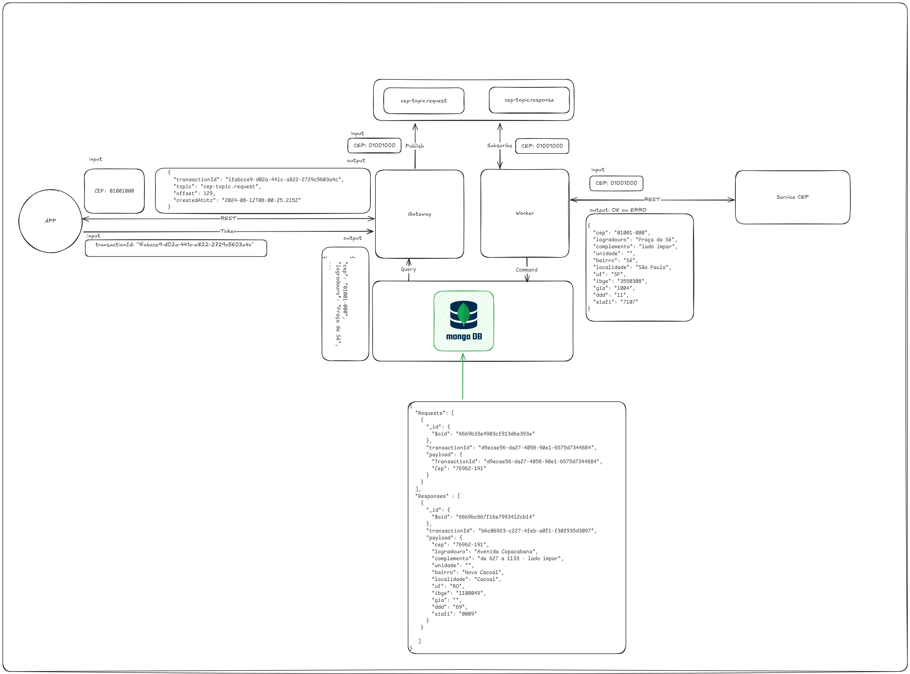

## Desenho de Solução da Arquiterura Modular/Microsserviço



## Modo de Desenvolvimento

Antes de iniciar o desenvolvimento das novas features, é necessário configurar o ambiente de desenvolvimento.

Para iniciar o projeto em modo de desenvolvimento, siga os passos abaixo:

Acesse a pasta src no terminal.
Execute o seguinte comando:

```cs
dotnet watch run --project .\APIGateway.Api\ --environment Development

dotnet watch 🚀 Started
info: APIGateway.Worker.Worker[0]
      Worker running at: 07/31/2024 00:27:43 -04:00
info: Microsoft.Hosting.Lifetime[14]
      Now listening on: http://localhost:5254
info: Microsoft.Hosting.Lifetime[0]
      Application started. Press Ctrl+C to shut down.
info: Microsoft.Hosting.Lifetime[0]
      Hosting environment: Development
info: Microsoft.Hosting.Lifetime[0]
      Content root path: C:\Projetos\.NET\APIGateway\src\APIGateway.Api
info: APIGateway.Worker.Worker[0]
      Worker running at: 07/31/2024 00:27:44 -04:00
info: APIGateway.Worker.Worker[0]
      Worker running at: 07/31/2024 00:27:45 -04:00
info: APIGateway.Worker.Worker[0]
      Worker running at: 07/31/2024 00:27:46 -04:00
```


```json
{
  "CEPs": [
    {
      "transaction_id": "c613660d-69ce-450c-a5f4-98ba99e0713a",
      "pipeline": "consultar-cep",
      "url": "",
      "query": "",
      "payload": "01001000",
      "response": {
        "cep": "01001-000",
        "logradouro": "Praça da Sé",
        "complemento": "lado ímpar",
        "unidade": "",
        "bairro": "Sé",
        "localidade": "São Paulo",
        "uf": "SP",
        "ibge": "3550308",
        "gia": "1004",
        "ddd": "11",
        "siafi": "7107"
      },
      "status_code": "200",
      "created_at": "2024-08-29T20:00:00.1000",
      "updated_at": "2024-08-29T21:00:00.1000"
    }
  ]
}
```